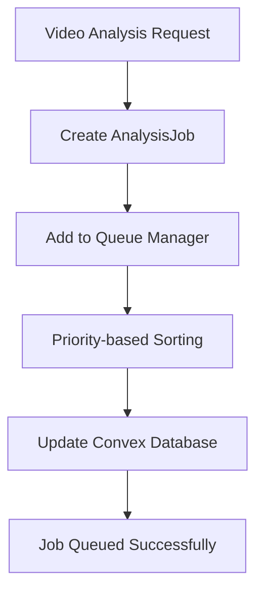
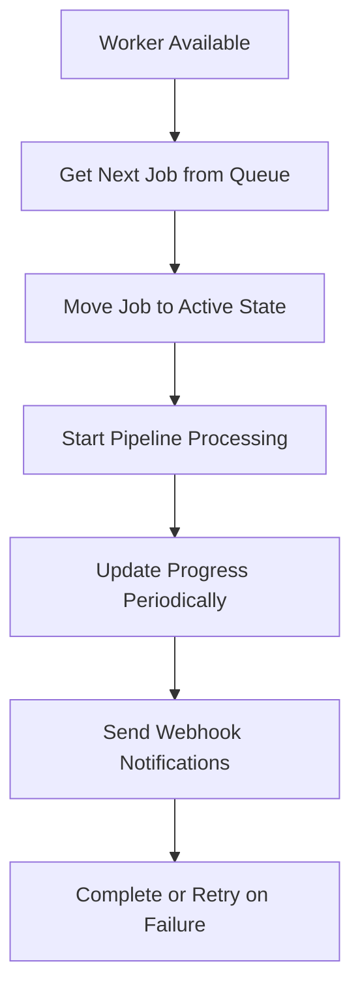

# 🚀 KlipStream Analysis Queuing System Guide

## 📋 Overview

The KlipStream Analysis API features a sophisticated queuing system designed to handle multiple concurrent video analysis jobs efficiently. This system provides priority-based job scheduling, resource management, automatic retry mechanisms, and comprehensive monitoring capabilities.

## 🏗️ Architecture Overview

The queuing system consists of several interconnected components:

### **Core Components:**

1. **Queue Manager** (`api/services/queue_manager.py`)
   - Central orchestrator for job queuing and processing
   - Handles priority-based job scheduling
   - Manages worker pool and resource allocation

2. **Job Manager** (`api/services/job_manager.py`)
   - Manages individual analysis jobs lifecycle
   - Tracks job progress and status updates
   - Handles webhook notifications and callbacks

3. **Convex Database Integration** (`convex/queue.ts`)
   - Persistent queue storage and management
   - Cross-session job persistence
   - Database-level queue operations

4. **API Routes** (`api/routes/queue.py`)
   - RESTful endpoints for queue management
   - Real-time queue status and metrics
   - Administrative queue operations

## 🔄 Job Lifecycle

### **1. Job Creation & Queuing**



**Process:**
1. Client submits video analysis request via `/api/v1/analysis`
2. System creates an `AnalysisJob` object with unique job ID
3. Job is added to the priority queue based on urgency level
4. Queue position is calculated and stored in Convex database
5. Client receives immediate response with job ID and estimated wait time

### **2. Job Processing**



**Process:**
1. Available worker picks up highest priority job from queue
2. Job status changes from "queued" to "processing"
3. Integrated analysis pipeline begins execution
4. Progress updates sent every 30 seconds via webhooks
5. Job completes successfully or enters retry mechanism

### **3. Progress Tracking**

The system provides real-time progress tracking through multiple stages:

- **Queued** (0%): Job waiting in queue
- **Downloading** (0-20%): Video and chat download
- **Transcribing** (20-40%): Audio transcription
- **Analyzing** (40-80%): Sentiment and emotion analysis
- **Finding Highlights** (80-95%): Highlight detection
- **Completed** (100%): Analysis finished

## 🎯 Priority System

### **Priority Levels:**

| Priority | Value | Description | Use Case |
|----------|-------|-------------|----------|
| **URGENT** | 4 | Immediate processing | Live stream analysis |
| **HIGH** | 3 | Fast-track processing | Premium users |
| **NORMAL** | 2 | Standard processing | Regular requests |
| **LOW** | 1 | Background processing | Batch jobs |

### **Queue Positioning:**
- Higher priority jobs are processed first
- Within same priority, FIFO (First In, First Out) ordering
- Queue positions automatically recalculated when priorities change

## ⚙️ Configuration & Limits

### **Default Settings:**
```python
# Queue Manager Configuration
MAX_CONCURRENT_JOBS = 3        # Maximum parallel processing
MAX_QUEUE_SIZE = 100          # Maximum queued jobs
DEFAULT_JOB_TIMEOUT = 3600    # 1 hour timeout
MAX_RETRIES = 3               # Retry attempts on failure
```

### **Resource Management:**
- **CPU Allocation**: Each job uses dedicated CPU cores
- **Memory Management**: 32GB memory per Cloud Run instance
- **Timeout Handling**: Jobs automatically terminated after 1 hour
- **Retry Logic**: Failed jobs retry up to 3 times with exponential backoff

## 📊 Monitoring & Metrics

### **Real-time Metrics:**

The system tracks comprehensive metrics accessible via `/api/v1/queue/metrics`:

```json
{
  "queue_length": 5,
  "active_jobs": 2,
  "active_workers": 2,
  "max_workers": 3,
  "utilization_percent": 66.67,
  "queue_utilization_percent": 5.0,
  "performance": {
    "total_jobs_processed": 150,
    "total_jobs_failed": 3,
    "total_jobs_retried": 8,
    "average_processing_time": 1847.5,
    "uptime_seconds": 86400
  }
}
```

### **Key Performance Indicators:**

1. **Throughput**: Jobs processed per hour
2. **Success Rate**: Percentage of successful completions
3. **Average Processing Time**: Mean job completion time
4. **Queue Wait Time**: Average time jobs spend in queue
5. **Worker Utilization**: Percentage of workers actively processing

## 🔧 API Endpoints

### **Queue Management:**

| Endpoint | Method | Description |
|----------|--------|-------------|
| `/api/v1/queue/status` | GET | Get current queue status |
| `/api/v1/queue/metrics` | GET | Get detailed queue metrics |
| `/api/v1/queue/pause` | POST | Pause job processing |
| `/api/v1/queue/resume` | POST | Resume job processing |
| `/api/v1/queue/drain` | POST | Drain queue (finish existing jobs) |
| `/api/v1/queue/clear` | POST | Clear all queued jobs |

### **Job Management:**

| Endpoint | Method | Description |
|----------|--------|-------------|
| `/api/v1/jobs/{job_id}/status` | GET | Get specific job status |
| `/api/v1/jobs/{job_id}/cancel` | POST | Cancel a specific job |
| `/api/v1/jobs/{job_id}/retry` | POST | Retry a failed job |
| `/api/v1/jobs/{job_id}/priority` | PUT | Update job priority |

## 🚨 Error Handling & Recovery

### **Failure Scenarios:**

1. **Network Timeouts**: Automatic retry with exponential backoff
2. **Resource Exhaustion**: Job queued until resources available
3. **Processing Errors**: Job marked as failed after max retries
4. **System Crashes**: Jobs recovered from Convex database on restart

### **Retry Mechanism:**
```python
# Retry Logic
retry_delays = [30, 120, 300]  # 30s, 2m, 5m
max_retries = 3
exponential_backoff = True
```

### **Dead Letter Queue:**
Failed jobs after max retries are moved to a dead letter queue for manual investigation.

## 🔄 Webhook Notifications

### **Progress Updates:**
The system sends webhook notifications for job progress updates:

```json
{
  "job_id": "uuid-string",
  "video_id": "2472774741",
  "status": "processing",
  "progress": {
    "percentage": 45.0,
    "current_stage": "Analyzing",
    "estimated_completion_seconds": 1200
  },
  "timestamp": "2024-01-15T10:30:00Z"
}
```

### **Webhook Configuration:**
- **Retry Policy**: 3 attempts with exponential backoff
- **Timeout**: 10 seconds per webhook call
- **Authentication**: Optional bearer token support

## 🛠️ Administrative Operations

### **Queue Management Commands:**

```bash
# Pause queue processing
curl -X POST https://klipstream-analysis-4vyl5ph7lq-uc.a.run.app/api/v1/queue/pause

# Resume queue processing
curl -X POST https://klipstream-analysis-4vyl5ph7lq-uc.a.run.app/api/v1/queue/resume

# Get queue status
curl https://klipstream-analysis-4vyl5ph7lq-uc.a.run.app/api/v1/queue/status

# Get detailed metrics
curl https://klipstream-analysis-4vyl5ph7lq-uc.a.run.app/api/v1/queue/metrics
```

### **Emergency Procedures:**

1. **Queue Overflow**: Increase `MAX_QUEUE_SIZE` or clear old jobs
2. **Worker Deadlock**: Restart queue manager via `/api/v1/queue/restart`
3. **Memory Issues**: Reduce `MAX_CONCURRENT_JOBS` temporarily
4. **Database Sync Issues**: Run queue reconciliation via admin endpoint

## 📈 Performance Optimization

### **Tuning Parameters:**

1. **Concurrent Jobs**: Adjust based on available resources
2. **Queue Size**: Balance memory usage vs. job capacity
3. **Timeout Values**: Optimize for typical job completion times
4. **Retry Intervals**: Balance quick recovery vs. system load

### **Scaling Strategies:**

1. **Horizontal Scaling**: Deploy multiple Cloud Run instances
2. **Vertical Scaling**: Increase CPU/memory per instance
3. **Queue Partitioning**: Separate queues by job type or priority
4. **Load Balancing**: Distribute jobs across multiple regions

## 🔍 Troubleshooting Guide

### **Common Issues:**

#### **Queue Not Processing Jobs**
```bash
# Check queue status
curl https://klipstream-analysis-4vyl5ph7lq-uc.a.run.app/api/v1/queue/status

# If paused, resume
curl -X POST https://klipstream-analysis-4vyl5ph7lq-uc.a.run.app/api/v1/queue/resume
```

#### **Jobs Stuck in Queue**
```bash
# Check for stuck jobs
curl https://klipstream-analysis-4vyl5ph7lq-uc.a.run.app/api/v1/queue/metrics

# Clear stuck jobs (admin only)
curl -X POST https://klipstream-analysis-4vyl5ph7lq-uc.a.run.app/api/v1/queue/clear-stuck
```

#### **High Memory Usage**
```bash
# Reduce concurrent jobs temporarily
curl -X PUT https://klipstream-analysis-4vyl5ph7lq-uc.a.run.app/api/v1/queue/config \
  -H "Content-Type: application/json" \
  -d '{"max_concurrent_jobs": 2}'
```

### **Monitoring Alerts:**

Set up alerts for:
- Queue length > 50 jobs
- Worker utilization > 90%
- Average processing time > 2 hours
- Failed job rate > 10%

## 💡 Best Practices

### **For Developers:**

1. **Job Design**:
   - Keep jobs idempotent (safe to retry)
   - Include comprehensive error handling
   - Provide meaningful progress updates

2. **Priority Usage**:
   - Use URGENT sparingly (live streams only)
   - Default to NORMAL for most requests
   - Use LOW for batch processing

3. **Webhook Implementation**:
   - Implement webhook endpoints with retry logic
   - Handle duplicate notifications gracefully
   - Use exponential backoff for failed webhooks

### **For Operations:**

1. **Capacity Planning**:
   - Monitor queue length trends
   - Scale workers based on demand patterns
   - Plan for peak usage periods

2. **Resource Management**:
   - Monitor memory and CPU usage
   - Adjust concurrent job limits based on performance
   - Implement circuit breakers for external dependencies

3. **Monitoring**:
   - Set up comprehensive alerting
   - Monitor job success rates
   - Track processing time trends

## 🔐 Security Considerations

### **Access Control:**
- Queue management endpoints require admin authentication
- Job status endpoints are publicly accessible
- Webhook URLs should use HTTPS with authentication

### **Data Protection:**
- Job metadata is encrypted at rest
- Webhook payloads exclude sensitive video content
- Failed job logs are automatically purged after 30 days

### **Rate Limiting:**
- Queue status endpoints: 100 requests/minute
- Job submission: 10 requests/minute per IP
- Admin operations: 5 requests/minute

## 📚 Code Examples

### **Creating a High Priority Job:**

```python
from api.services.queue_manager import QueueManager, QueuedJob, JobPriority
from datetime import datetime

# Create high priority job
job = QueuedJob(
    job_id="urgent-stream-123",
    video_id="live_stream_456",
    video_url="https://twitch.tv/videos/123456",
    priority=JobPriority.HIGH,
    queued_at=datetime.utcnow(),
    callback_url="https://your-app.com/webhooks/analysis",
    metadata={"user_id": "premium_user_789"}
)

# Add to queue
queue_manager = QueueManager()
success = await queue_manager.enqueue_job(job)
```

### **Monitoring Queue Health:**

```python
import asyncio
from api.services.queue_manager import QueueManager

async def monitor_queue():
    queue_manager = QueueManager()

    while True:
        status = await queue_manager.get_queue_status()

        # Alert if queue is backing up
        if status["queue_length"] > 20:
            print(f"WARNING: Queue length is {status['queue_length']}")

        # Alert if no workers active
        if status["active_workers"] == 0 and status["queue_length"] > 0:
            print("CRITICAL: No active workers but jobs in queue")

        await asyncio.sleep(60)  # Check every minute
```

### **Custom Progress Callback:**

```python
async def custom_progress_callback(job):
    """Custom callback for job progress updates"""
    print(f"Job {job.id}: {job.status.value} - {job.progress_percentage:.1f}%")

    # Send to external monitoring system
    await send_to_monitoring_system({
        "job_id": job.id,
        "video_id": job.video_id,
        "progress": job.progress_percentage,
        "stage": job.status.value,
        "timestamp": job.updated_at.isoformat()
    })

# Register callback
job_manager.register_progress_callback(job_id, custom_progress_callback)
```

## 🚀 Future Enhancements

### **Planned Features:**

1. **Advanced Scheduling**:
   - Time-based job scheduling
   - Recurring analysis jobs
   - Batch job processing

2. **Enhanced Monitoring**:
   - Real-time dashboard
   - Performance analytics
   - Predictive scaling

3. **Multi-Region Support**:
   - Cross-region job distribution
   - Failover mechanisms
   - Global load balancing

4. **Machine Learning Integration**:
   - Intelligent job prioritization
   - Processing time prediction
   - Resource optimization

---

**Last Updated**: January 2025
**Version**: 2.0.0
**Status**: Production Ready
**API Endpoint**: https://klipstream-analysis-4vyl5ph7lq-uc.a.run.app
